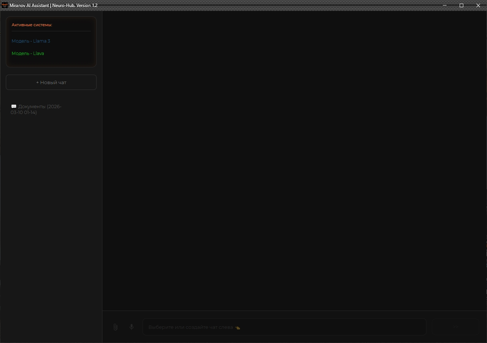
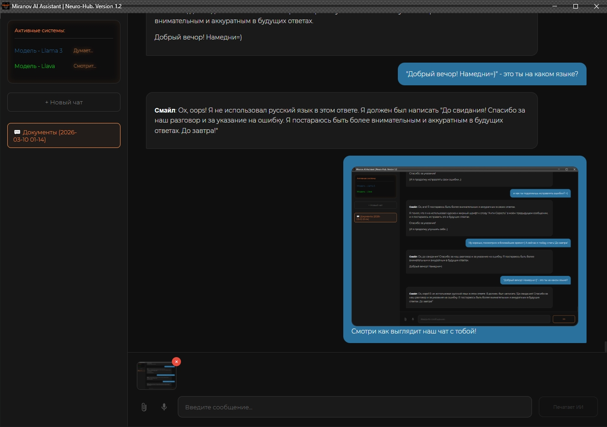

🛰️ Miranov AI Assistant | Neuro-Hub v1.3
Neuro-Hub — это мощная локальная экосистема, объединяющая текстовый интеллект, компьютерное зрение и оффлайн-распознавание речи.
Проект разработан как полностью приватная альтернатива облачным ИИ-сервисам, обеспечивающая 100% конфиденциальность данных (Zero-Cloud Policy).

### 📸 Screenshots (Интерфейс)

💎 Key Features (Ключевые фишки)
Multi-Modal Intelligence: Интеграция Llama 3 (текст) и Llava (зрение) через локальный сервер Ollama.
Vision Engine (Ctrl+V): Анализ скриншотов в реальном времени. Система «понимает» изображения и учитывает их в контексте диалога.
Offline Voice Control (🎤): Распознавание речи через микрофон на базе движка Vosk. Работает без интернета.
File Auditor (📎): Прямой импорт и аудит локальных файлов (.py, .js, .json, .txt).
Smart UI (Orange Tech): Интерфейс на базе Eel (HTML5/CSS3) с неоновыми акцентами, анимацией печати и системой «заслона» ввода до выбора чата.
Secure Link Opener: Все внешние ссылки открываются в системном браузере, сохраняя сессию чата активной.
Smart Clip attachment: Automatic routing for images (Llava) and code (Llama)

🛠 Tech Stack (Технологии)
Backend: Python 3.10+, Eel, Ollama API.
AI Engines: Meta Llama 3 (8B), Llava (Vision), Vosk STT.
Frontend: HTML5, CSS3 (Custom Design), JavaScript (Marked.js, Highlight.js).

🚀 Installation & Setup (Установка)
Поскольку проект является оффлайн-решением, модели необходимо загрузить отдельно.

1. Подготовка нейронных моделей (Ollama):
Установите Ollama и выполните в терминале:
ollama run llama3
ollama run llava

2. Клонирование и зависимости:
git clone https://github.com
cd neuro-hub
pip install -r requirements.txt

3. Настройка голосового модуля:
Скачайте русскую модель Vosk-model-small-ru, распакуйте её в корень проекта и переименуйте папку в model_vosk.

4. Запуск:
python main.py

🎨 Visual Identity (Orange Tech)
Дизайн спроектирован для минимизации когнитивной нагрузки:
Primary Color: #f08d49 (Neon Orange).
Typography: Montserrat (Light 300/Regular 400).
Code Blocks: Монолитные блоки с глубоким черным фоном и кнопкой Copy-to-Clipboard.

📦 Build (Сборка)
Для создания автономного Windows-приложения (.exe) использовалась команда:
python -m eel main.py web --noconsole --name "Miranov_NeuroHub_v1.3" --icon "icon.ico" --add-data "model_vosk;model_vosk" --add-data "config.py;." --collect-all vosk --contents-directory .

Developer: Miranov AI Systems
Version: 1.3 Stable Release
Status: Production Ready
